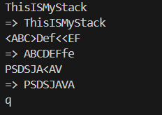
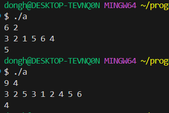
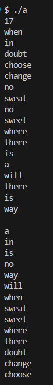

### 22200066 김동하 05분반

##### 프로그래밍 스튜디오 DS Lab 010

### 소감

## 사진

---
+ ___DS091 STL Stack 사용___  

+ ___DS092 Heap___  

+ ___DS093 Bubble Sort 구현___  

---

+ **91번문제** STL Stack 사용  
> 전에 풀었던 코드만 가져와서 Stack만 STL 코드로 변경했다. 그러던 중에 한가지 사실을 발견했는데, pop이 요소를 빼서 리턴하는게 아니라 그냥 지운다는 사실을 발견했다.

+ **92번문제** Heap  
> make_heap, pop_heap 을 사용했다. heap의 특성상 가장 큰 원소는 root이기에, 2번째로 큰 수를 원하면, n-1번 지우고 그 root 값을 리턴했다.  

+ **93번문제** 단어 정렬 
> 알고리즘에 sort 함수를 사용했다. 검색해보니, 람다 함수를 사용해서 정렬 방법까지 지정할 수 있다길래 써보니까 만족스러웠다. 

---

STL 너무 편하다. 확실이 STL을 그냥 쓰는 것 보다, 이게 어떠한 역할을 하고 있는지 알고 쓰는것이 더 이해와 사용에 용이한 것 같다.
