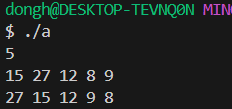
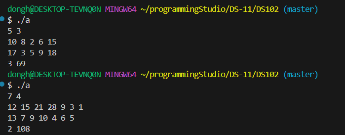
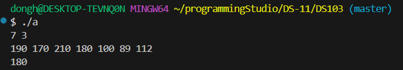
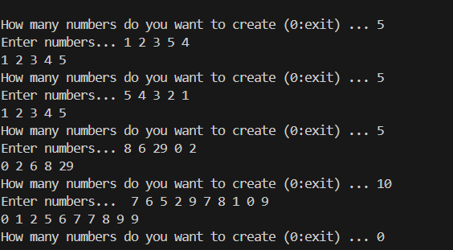

### 22200066 김동하 05분반

##### 프로그래밍 스튜디오 DS Lab 011

### 소감

## 사진

---
+ ___DS101 Sorting___  

+ ___DS102 최댓값___  

+ ___DS103 상 받기___  

+ ___DS104 Linked sorted___  

---

+ **101번문제** Sorting
> 그냥 단순히 sorting 하는 문제라 Merge sort를 사용해 봤다. 

+ **102번문제** 최댓값  
> 그냥 배열 두개에서 가장 큰 값만 모으는 프로그램이다. 이번에는 quick sort도 풀었다.  

+ **103번문제** 상 받기 
> 몇명까지 상을 탈 수 있나라는 프로그램이다. Sorting하고 그냥 인덱스만 알면 되는 간단한 문제다.

+ **104번문제** Linked Sort
> 이미 주어진 문제를 그냥 C++ 스타일로 바꾸는 문제다. 그런 김에 어떻게 구현하는지 봤는데, 생각보다 체계적으로 되어있다.

---

STL 너무 편하다. 확실이 STL을 그냥 쓰는 것 보다, 이게 어떠한 역할을 하고 있는지 알고 쓰는것이 더 이해와 사용에 용이한 것 같다.
