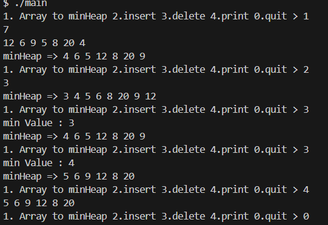
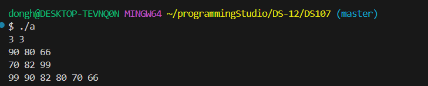
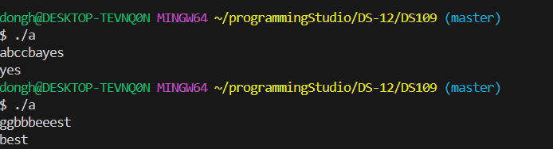
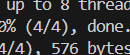

### 22200066 김동하 05분반

##### 프로그래밍 스튜디오 DS Lab 012

### 소감

## 사진

---
+ ___DS106 Heap ADT___  

+ ___DS107 list merge___  

+ ___DS108 상 받기___  

+ ___DS109 Linked sorted___  

+ ___DS110 Linked sorted ver2___  

---

+ **106번문제** Heap ADT
> 

+ **107번문제** list merge  
> 리스트 두개를 합치고 정렬하는 프로그램이다. 이번에 STL list를 배워서 사용해보고 싶었다. 확실히 STL 쓰는게 편하고 빠르다.

---

한 학기가 거의 끝나간다. 코딩을 많이 할 수 있어서 정말 좋았다. 방학때 하는 프로그램에도 신청했다. Sorting 더 열심히 공부해야겠다.
