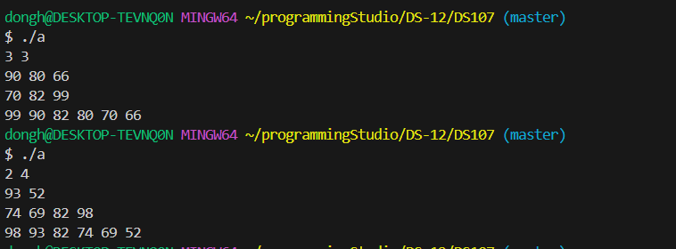
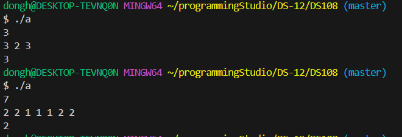
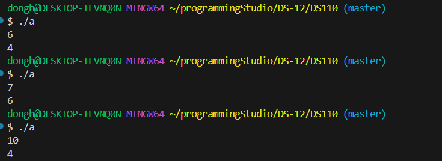

### 22200066 김동하 05분반

##### 프로그래밍 스튜디오 DS Lab 012

### 소감

## 사진

---
+ ___DS106 Heap ADT___  

+ ___DS107 list merge___  

+ ___DS108 가장 많은 중복 찾기___  

+ ___DS109 Linked sorted___  

+ ___DS110 Linked sorted ver2___  

---

+ **106번문제** Heap ADT
> 

+ **107번문제** list merge  
> 리스트 두개를 합치고 정렬하는 프로그램이다. 이번에 STL list를 배워서 사용해보고 싶었다. 확실히 STL 쓰는게 편하고 빠르다.

+ **108번문제** 가장 많은 중복 찾기  
> Vector 리스트로 리스트를 만든다음에 include algorithm을 사용해서 sort한다. 그러면 같은 숫자들이 뭉치게 되고, 본인의 숫자와 다음의 숫자가 다르면 중복이 끝났다고 판한하여, 가장 많은 수의 count를 저장한다. 마지막까지 진행하면 가장 많은 중복 수의 값이 나오게 된다.

+ **109번문제** 중복 문자 제거  
>Stack에 하나씩 집어 넣다가, 만약 중복 문자가 발견된다면 지우고 진행하는 식으로 진행했다. 이러면 문제가 마지막에 남은 Stack에 거꾸로 된 문자열이 담긴다는 것인데, 새로운 스택으로 뒤집어서 해결했다. 

---

한 학기가 거의 끝나간다. 코딩을 많이 할 수 있어서 정말 좋았다. 방학때 하는 프로그램에도 신청했다. Sorting 더 열심히 공부해야겠다.
