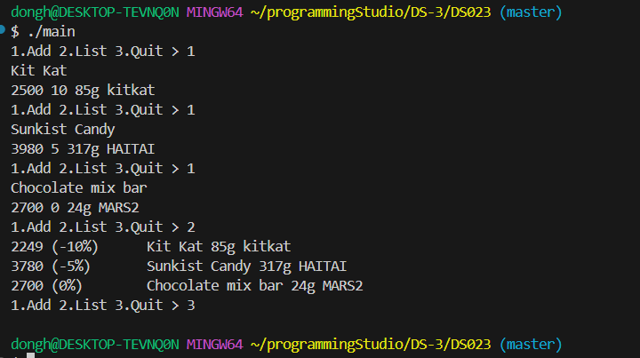
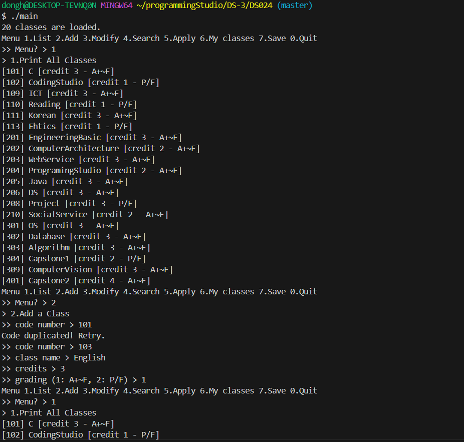
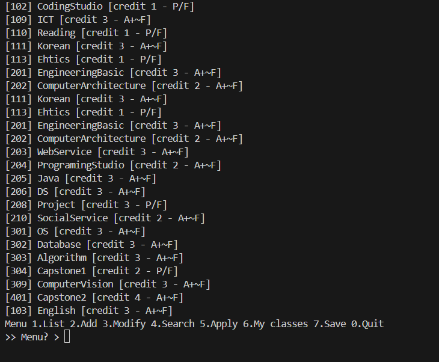
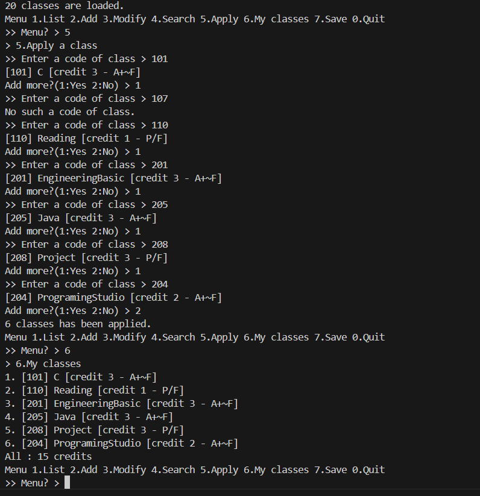
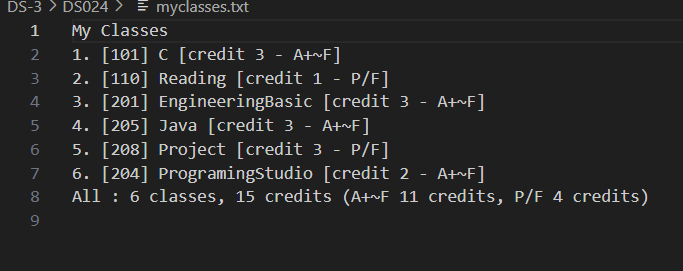

### 22200066 김동하 05분반

##### 프로그래밍 스튜디오 DS Lab 003

### 소감

## 사진

---
+ ___DS021 성적 계산하기___

+ ___DS022 졸업영어성적 판단하기___

+ ___DS023 쇼핑몰 상품 정보 관리리___

+ ___DS024 수강신청 프로그램 Add a classes___

+ ___DS024 Apply classes___

+ ___DS024 Output of applied Classes___

---

+ **21번문제**  여러 정보를 입력 받아서 평균을 출력하는 프로그램.
>드디어 Class의 등장이다. 인터넷에서 따로 공부할 때, 사람들이 Class를 사용하는 것을 보고, 나도 언젠가 저기에 도달하겠지라고 생각한 두번째 구간에 도착했다. 참고로 첫번째 구간은 포인터다.  Class 사용에는 문제 없었는데, iostream만 사용해서 공백포함 문자열을 받는 것이 정말 오래 걸렸다. 결국에는 char word를 생성해서, cin.getline으로 문자열을 받고, 그것을 다시 string에 옮기는 비효율적인 방법으로 구현했다. 여러모로 아쉬운 프로그램.

+ **22번문제** 간단하게 이름과 성적을 입력 받아서 Pass/Fail인지 보는 문제
>이것도 마찬가지로 iostream만 사용해서 이름을 받는 것이 너무 어려웠다. 같은 방법으로 해결하긴 했으나, 아쉽다.

+ **23번문제** 상품을 추가하고, 할인된 가격을 출력하는 프로그램
>이 문제, 상당히 어려운 문제다. 일단 첫번째 벽. 포인터 변수 사용하기. 도대체 어디서 포인터 변수를 사용하는거지? 라고 생각했다가 풀면서 자연스럽게 알게 되었다. 지금까지 만들어온 프로그램은 사실, 먼저 몇개 입력할지 정하고 그 다음에 입력하는 식인데, 이건 아니다. 무한대로 입력할 수 있게 구성해야한다. 그래서 선택한 방법은 조금 난잡한데, 설명하면 이러하다.

>1.먼저 크기가 2인 클래스가 있다고 가정한다.
>2.사용자가 Add하면, 크기가 3인 클래스 포인터를 새로 만든다.
>3.크기가 3인 클래스 포인터 안에, 크기가 2인 클래스의 정보를 전부 넣는다.
>4.크기가 2인 클래스의 메모리를 지우고 크기가 3인 클래스의 주소값을 크기가 2인 클래스에 할당한다.
>5.크기가 3인 클래스를 NULL화 시킨다.

>참으로 아쉬운 문제다. 더 좋은 방법이 있을 것 같은데 그리고 출력의 포멧팅도 제대로 성공하지 못했다. 분명 \t를 어딘가에 사용하는 것 같은데, 잘 안보인다.

+ **24번문제** 수강신청 프로그램.
>와... 일단 문제의 길이에 놀랐지만, 길다고 어려운 문제는 아니기에 차근차근 읽어봤다. 그러자 문제 자체는 어렵지 않다는 것을 알게됬는데, **클래스 사용**의 모든 정수가 문제 안에 있었다! 문제를 푸는 것 보다 감상하게 되었다. 진짜 멋진 코드다. 나머지는 그냥 주어진 변수들을 사용하니 쉽게 풀렸다. 난이도 보다는 자, 클래스는 이렇게 사용하는 거야 알았지? 를 보여준 프로그램이라, 가장 재미있게 풀었다.

---

문제의 질이 점점 좋아진다. 재미있어진다. 어려워진다 == 재미있어진다랑 같은 말이다. 클래스 사용법을 빠르게 익혀서 DS024같은 프로그램을 만들고 싶다. 진심이다.

