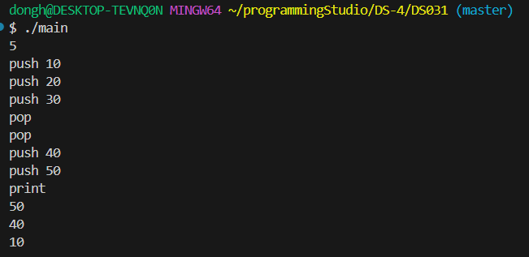
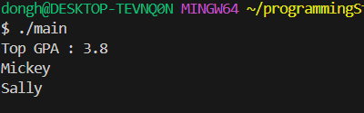
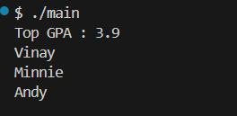
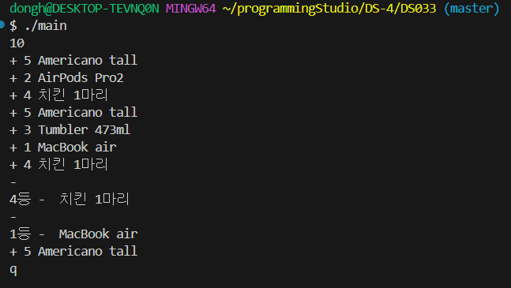
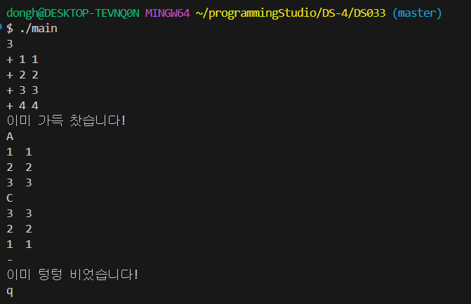

### 32200066 김동하 05분반

##### 프로그래밍 스튜디오 DS Lab 004

### 소감

## 사진

---
+ ___DS031 MyStack 만들기___

+ ___DS032 GPA 분석하기___

+ ___DS033 쿠폰 관리기___

---

+ **31번문제**  MyStack 만들기
> 이번에는 헤더파일을 분리해야 한다고 문제에 있었다. 심지어 makefile까지? 좀 낮설긴 했는데, Stack이 어려운 개념이 아니고, 헤더도 처음에 어떻게 하는지만 안다면 쉬운거여서 금방 했다. 문제는 makefile인데, 한 번 익히니까, 없이는 못 살겠다. 특히 헤더가 여러개면 진짜 makefile 없으면 힘들 것 같다. 

+ **32번문제** GPA 분석하기기
> 내가 원한건 GPA를 클래스로 따로 빼서 헤더로 만들고 하려고 했는데, 31번 문제를 복사해서 하니 오류가 계속 생겨서 과감하게 전부 지우고 스스로 하나하나 필요한 메소드와 클래스를 입력해서 작성했다. 시도해 본것은 헤더가 여려개면 어케 해야하나를 실험했는데, TA님에게 질문해서 쉽게 풀었다. #pragma once -> 이것의 부재가 오류의 원인이다.

+ **32번문제** 쿠폰 관리기
> 확실히 헤더파일이 좋긴 좋다. 코드가 줄어들고 분리되는 모습을 보니 기쁘다. 구조체 typedef로 만든 다음에 Stack에 하나씩 넣고 빼는 것을 구현했다. 예시에는 없지만 전부 출력과 전부 pop도 구현해서 좋았다.

---

다음 문제가 linked list 던데, 벌써 기대된다. 확실한건 C++이 C 보다는 훨씬 재미있다는 것이다. 이제 C는 못하겠다. 

