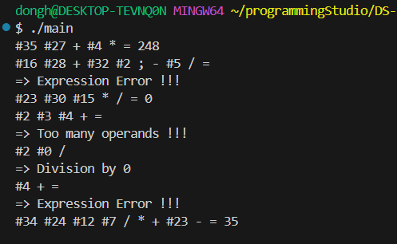

### 22200066 김동하 05분반

##### 프로그래밍 스튜디오 DS Lab 004

### 소감

## 사진

---
+ ___DS041 MyLinkedStack 만들기___

+ ___DS042 MyLinkedStack을 이용한 계산기___

+ ___DS043 사용자가 입력한 문자열 알아내기___

---

+ **41번문제**  MyLinkedStack 만들기
> 저번에 만들었던 stack의 linkedlist 버전이다. 제공된 코드를 이용해 모자른 부분을 채우고, 다듬었다. 딱히 어려운 부분은 없었다. 스택이여서 Tail이 없기 때때문이다.

+ **42번문제** MyLinkedStack을 이용한 계산기
> 이거 좀 어려웠다. 일단 내가 생각한대로 동작하지 않아서 여러번 돌려야했다. 사실 로직자체는 그렇게 어려운건 없었지만, 여러가지 예외처리가 힘들었다. 특히 문자앞에 #가 있어서 잘라야하는 것과, 파일을 입출력으로 받는다는게 조금 번거로웠다. 최대한 테스트케이스와 유사하게 만드려고 노력했다.

+ **43번문제** 사용자가 입력한 문자열 알아내기
> 이거 로직 어렵다. 일단 예시를 종이에다 적어서 하나하나 순서대로 적용시켜보니, 답이 보였다. 사실 이런 문제 푸는게 제일 재미있다.

---

C++ 문제 난이도 갑자기 확확 뛴다. 그래서 좋다. 내가 막히는 구간이 오지 않도록 열심히 해야겠다. 과제를 하다보면 느끼는건데, 확실히 프로그래머스를 꾸준히 푼게 도움이 많이 된 것 같다. 

