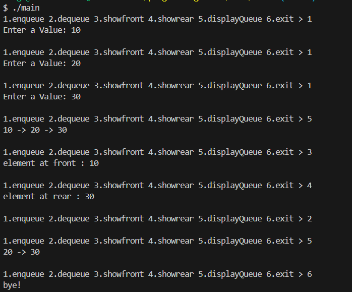
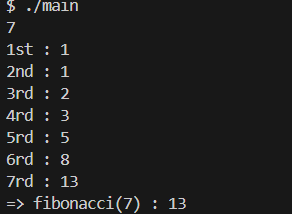
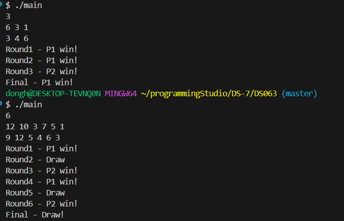

### 22200066 김동하 05분반

##### 프로그래밍 스튜디오 DS Lab 007

### 소감

## 사진

---
+ ___DS061 MyLinkedQueue 만들기___

+ ___DS062 피보나치 수열 만들기___

+ ___DS063 카드 대결 게임___

---

+ **61번문제**  MyLinkedQueue 만들기
> Linked Queue는 훨씬 좋다. 귀찮은 Full, Empty 체크를 하지 않아도 되기 때문이다. Linked List에서 몇가지 함수만 사용하면 쉽게 풀린다.

+ **62번문제** 피보나치 수열 만들기
> 피보나치 수열은 생각보다 쉽다. 처음에 예외상황만 설정해 준다면, 나머지는 쉽게 풀 수 있디

+ **63번문제** 카드 대결 게임
> 이거 로직자체는 쉬운데, 핀트를 잘못 잡아서 고생 좀 했다. 전판 나의 카드 숫자가 아니라 전판 나의 대결 숫자를 가져와야하는데, 그 부분에서 조금 시간을 많이 썼다.

---

다음 문제를 보니 Sorting이 나오던데, 가장 기본적이면서도 어려운 부분이기에, 열심히 공부해서 Sorting도 잘 해봐야겠다.

