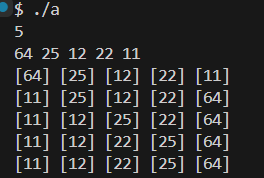

### 22200066 김동하 05분반

##### 프로그래밍 스튜디오 DS Lab 008

### 소감

## 사진

---
+ ___DS071 Selection Sort 구현___  

+ ___DS072 Insertion Sort 구현___  

+ ___DS073 Bubble Sort 구현___  

+ ___DS074 Quick Sort 구현___  

+ ___DS075 Merge Sort 구현___  

+ ___DS076 Sorting 라이브러리___  

+ ___DS076 Sorting 라이브러리___  

---

+ **71번문제** Selection Sort 구현  
> 선택 정렬은 가장 작은 값을 선택하는 방식이라 단순하다. 내가 지금까지 했던 정렬이 이것이라는 것을 알게되었다.

+ **72번문제** Insertion Sort 구현  
> 이거 직관적이지도 않고, 마음에도 안든다.

+ **73번문제** Bubble Sort 구현  
> 그냥 인접한 두 개의 수만 정렬한다는 느낌이다. 직관적이고, 빠르지는 않지만, 구현은 쉽다. swap이 가장 쓸모있어지는 정렬인것 같다.

+ **74번문제** Quick Sort 구현  
> 이게 진짜 킥이다. 사실 3월달에 sorting을 찾아보다가 스스로 공부한 적이 있었는데, 복습하는 마음으로 했다.

+ **75번문제** Merge Sort 구현  
> 가장 어려웠다. 일단 개념 자체가 quick 보다 어렵고, 코드도 길었다.

+ **76번문제** Sorting 라이브러리 
> 그냥 소팅들을 모아둔 프로그램
---

정렬은 정말 많은 것 같다. 이번에 과제를 하면서 다른 정렬들도 검색을 해봤는데, Bogo Sorting을 찾았다. 이게 진짜 웃긴 정렬인 것 같다. 나는 앞으로 quick을 자주 사용할 것 같다.
