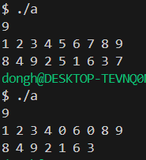
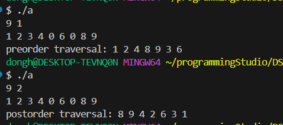
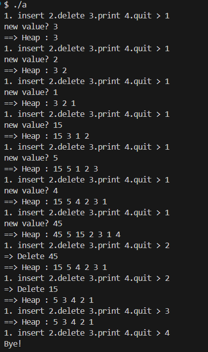

### 22200066 김동하 05분반

##### 프로그래밍 스튜디오 DS Lab 009

### 소감

## 사진

---
+ ___DS081 print In Order 구현___  

+ ___DS082 Insertion Sort 구현___  

+ ___DS083 Bubble Sort 구현___  

---

+ **81번문제** print In Order 구현  
> 제공된 소스코드를 가져와서 만들었다. pointer를 사용해서 배열을 구성했다.

+ **82번문제** Insertion Sort 구현  
> 

+ **83번문제** Bubble Sort 구현  
> 

---

정렬은 정말 많은 것 같다. 이번에 과제를 하면서 다른 정렬들도 검색을 해봤는데, Bogo Sorting을 찾았다. 이게 진짜 웃긴 정렬인 것 같다. 나는 앞으로 quick을 자주 사용할 것 같다.
