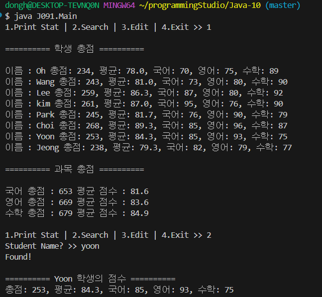
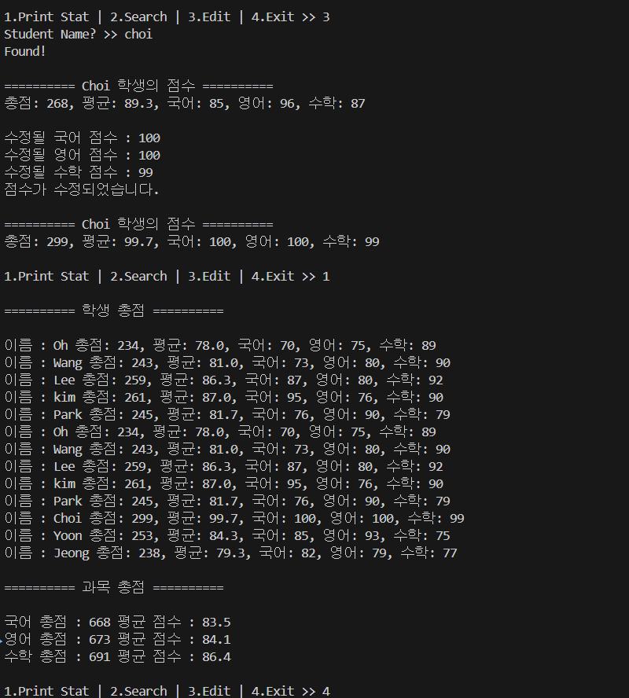
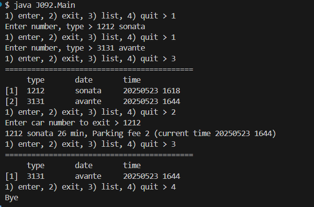

### 22200066 김동하 05분반

##### 프로그래밍 스튜디오 Java Lab 010

### 소감

## 사진

---
+ ___J091 Hashmap___

+ ___J091 Hashmap___

+ ___J091 Parking System___

---

+ **91번문제** Hashmap
> 전에 만들었던 ScoreManager를 hashmap으로 변경하고, CRUD로 만드는 프로그램이다. Hashmap 이거 정말 좋다. 신세계다.

+ **92번문제** Parking System
> 주차장 관리 프로그램이다. 날짜를 받아서 계산하는 과정을 했는데, 날짜도 받을 수 있다는 사실이 놀라웠다.

+ **93번문제** 
> 

+ **94번문제** 
> 

---

