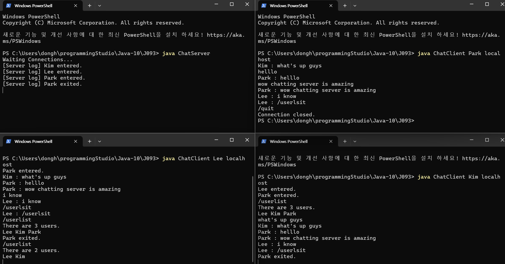
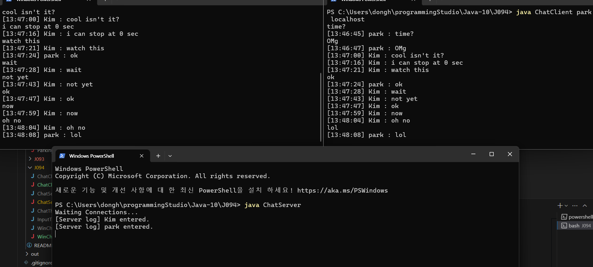

### 22200066 김동하 05분반

##### 프로그래밍 스튜디오 Java Lab 010

### 소감

## 사진

---
+ ___J091 Hashmap___

+ ___J091 Hashmap___

+ ___J092 Parking System___

+ ___J093 userlist___

+ ___J094 date___

---

+ **91번문제** Hashmap
> 전에 만들었던 ScoreManager를 hashmap으로 변경하고, CRUD로 만드는 프로그램이다. Hashmap 이거 정말 좋다. 신세계다.

+ **92번문제** Parking System
> 주차장 관리 프로그램이다. 날짜를 받아서 계산하는 과정을 했는데, 날짜도 받을 수 있다는 사실이 놀라웠다.

+ **93번문제** UserList
> Chat Server의 코드를 수정해서 명령어를 만들어보는 과제다. 일단 이미 있는 명령어, to를 참고해서 구조를 보았다. 그러자 읽은 라인에서 명령어가 있는지 확인하는 while문을 발견했고, 거기에 추가해서 메소드를 호출하는 식으로 코딩했다. 일단 다른 쓰레드에 있는 해시맵의 정보를 불러와야한다는 것을 깨달았는데, 고민하다가 synchronized 라는 명령어로 구할 수 있었고, 타입도, 커서를 가져다대니 Object 타입이라는 것을 알아서 풀 수 있었다.

+ **94번문제** date 
> 이건 쉬운 문제다. 현재 시간을 얻어오는 함수를 만들고, 날짜를 리턴한 다음에 그냥 boradcast에 같이 넣어서 보낸다.

---

일단 해시맵, 너무 좋다. 데이터 관리의 끝판왕인 것 같다. 그리고 채팅서버 프로그램을 수정하는 것. 이번 과제 진짜 재미있었다. 이미 완성된 프로그램을 조금 수정해서 기능을 추가하는 것. 이거 어렵지만, 코딩실력을 늘리는 것에는 도움이 많이 되는 것 같다..

