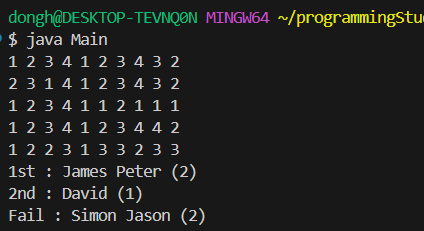

### 22200066 김동하 05분반

##### 프로그래밍 스튜디오 Java Lab 003

### 소감

## 사진

---
+ ___J021 비만인 사람은 몇명인가?___

+ ___J022 아파트 크기별 개수 세기___

+ ___J023 입력 받은 숫자들의 총합계와 평균 값 구하기___

+ ___J024 두번째로 큰 수의 순서 찾기___

+ ___J025 배열을 이용해 연중 날짜 계산하기___

+ ___J026 입력받은 숫자 중에 가장 큰 수와 가장 작은 수 구하기___

+ ___J027 누가 비만인가?___

+ ___J028 5명의 점수 분석하기기___

+ ___J029 겹치지 않는 숫자 10개 입력 받기___

+ ___J030 5명의 점수 채점하고 등급매기기기___

---

+ **21번문제**  여러 사람의 키 몸무게 입력받고 비만 찾기
> 너무 쉬운 문제이니 생략. java의 배열 사용법을 알았다.

+ **22번문제**  아파트 크기별 개수 세기
> 이하동문.

+ **23번문제** 입력 받은 숫자들의 총합, 평균 구하기
> 이하동문.

+ **24번문제** 두번째로 큰 수 찾기
> 이거 조금 해맸다. 이유는, 원래 가장 크던 수보다 더 큰수가 나오면 원래것은 second로 가야하는데, 날려서 조금 해맸다.

+ **25번문제** 배열로 날짜 구하기
>지금까지 switch로 많이 했는데, 확실히 배열로 하니 깔끔하고 좋다.

+ **26번문제** 가장 큰 수, 가장 작은 수 찾기
>너무 평범한 문제라 스스로 Sorting 해서 넣을까 했지만 그냥 했다.

+ **27번문제** 누가 비만인가
> 오호, C++에서 처음본  new int[size]; 가 나왔는데, 자바에서도 사용가능한지 몰랐다.

+ **28번문제** 5명의 점수 분석
>C실습에서도 자주 해봤던 문제. 가장 힘든 부분은 변수들을 일일이 입력하는 부분이다.

+ **29번문제** 안겹치는 숫자 10개
>총 갯수를 count로 하고 중복이면 count-- 로 구현했다. 생각보다 재미있었던 문제. c실습에서 복권 프로그램 만들기가 떠올랐다. 이유는 없다.

+ **30번문제** 답안지 채점 프로그램
>이거 고등학생 때 게임 만들겠다고 막 스스로 공부하던 시절 만든 Mapping 시스템이랑 비슷하게 생긴 문제다. 문제의 컨셉도 좋고 난이도도 좋아서 만족스러웠던 문제다.  

---

자바을 하면 할 수 록 C/C++이랑 비슷하긴한데, 세부 문법이나 함수에서 차이점을 느낀다. 자바와 C++을 동시에 하는 것이 가끔 헷갈릴 때가 있긴한데, 나중에 실무에서도 여러가지 언어들을 동시에 사용해야하는 경우가 있을 수 있기에, 정말 좋은 경험이라고 생각하고 있다.

