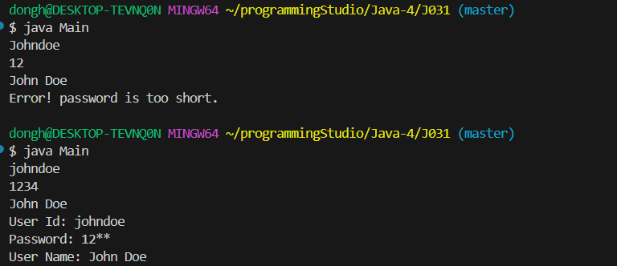
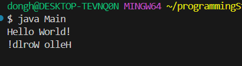
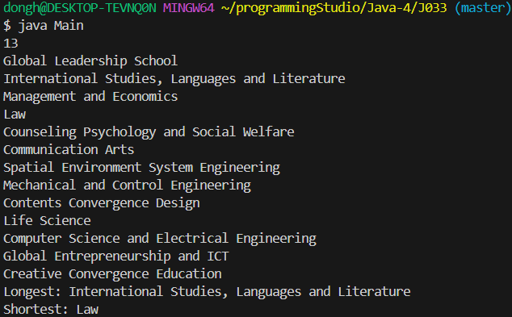
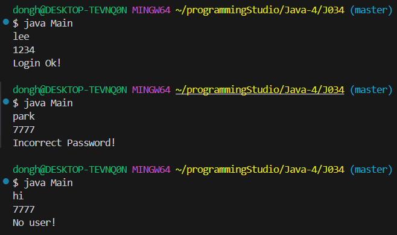
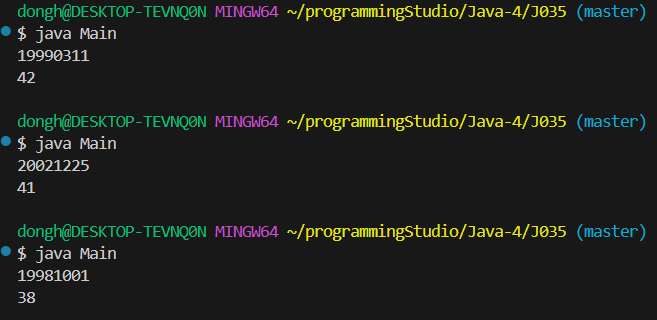
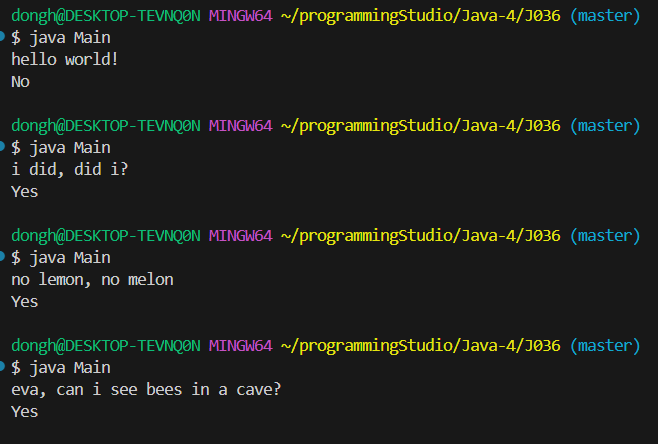
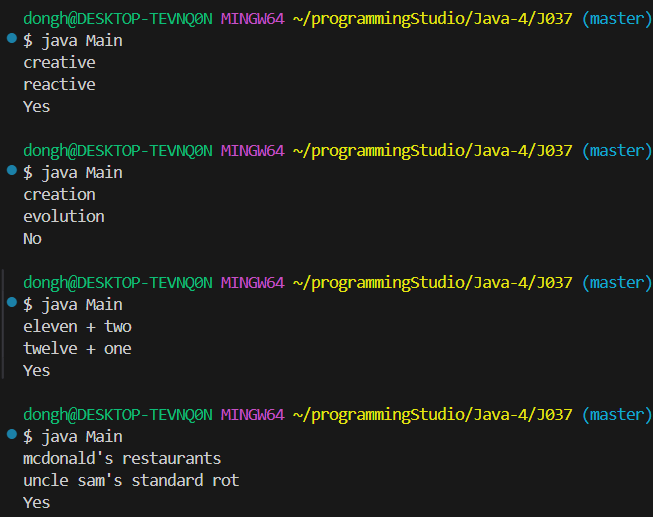

### 32200066 김동하 05분반

##### 프로그래밍 스튜디오 Java Lab 004

### 소감

## 사진

---
+ ___J031 회원가입 아이디/비번 입력받기___

+ ___J032 문자열 거꾸로 출력하기___

+ ___J033 학부 영문 이름 중 가장 긴 것과 가장 짧은 것을 찾아라___

+ ___J034 회원로그인 아이디/비번 검사하기___

+ ___J035 생년월일을 분해해 숫자 만들기___

+ ___J036 회문검사하기___

+ ___J037 애너그램 판별하기___

---

+ **031번문제**  회원가입 아이디/비번 입력받기
> 자바에서 가장 편한점은 String을 굳이 선언해서 조작하는게 아닌, "ha" 이 상태에서 바로 사용할 수 있다는 점이다.

+ **32번문제**  문자열 거꾸로 출력하기
> 문자열을 char[]로 변경한 다음에, 하나하나 역순으로 다른 char[]에 저장하고 String으로 변경했다. 함수가 없는게 아쉽다.

+ **33번문제** 학부 영문 이름 중 가장 긴 것과 가장 짧은 것을 찾아라
> 일단 개행문자를 성공적으로 제거하고, shortest를 첫 학부 이름으로 지정했다. 그렇게 하지 않았더니, shortest의 초기 값이 애매해져서 string의 최대 바이트 갯수까지 긴 문자열을 넣으려고 했으나 패스했다.

+ **34번문제** 회원로그인 아이디/비번 검사하기
> 일단 알고 있는 정보는, 배열의 순서가 같다는 점이다. 즉, userid[1] 면, password[1] 이라는 것이기에, 비교하고 , 비교하면 쉽게 풀리는 문제다. 

+ **35번문제** 배열로 날짜 구하기
> substring으로 자리마다 자른 다음에 더했다. 쉬운문제.

+ **36번문제** 회문검사하기
> 조금 까다로운 문제이긴 한데, replaceAll("[^ㄱ-ㅎㅏ-ㅣ가-힣a-zA-Z0-9]","") 함수로 특수문자를 전부 없애버렸다. 그 다음에 거꾸로 출력하기를 가져와서 돌리면 정답이 나온다.

+ **37번문제** 애너그램 판별하기
> 일단 특수문자를 돌리고, sort 함수를 사용해서 글자들을 전부 나열했다. 그리고 둘이 같은지 비교했다.

---

자바에도 C++이랑 비슷할 정도로 유용한 함수들이 많은 것 같다 특히 [^ㄱ-ㅎㅏ-ㅣ가-힣a-zA-Z0-9] 이런 식으로 범위 지정하는 것은 진짜 다른 언어에도 가져가고 싶다는 생각이 들었다.

