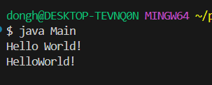

### 22200066 김동하 05분반

##### 프로그래밍 스튜디오 Java Lab 004

### 소감

## 사진

---
+ ___J041 로또번호 만들기___

+ ___J042 로또번호 입력받기___

+ ___J043 로또번호 당첨 확인하기___

+ ___J044 Random Password 만들기___

+ ___J045 랜덤코드 만들기___

+ ___J046 문자열을 다루는 유틸리티 클래스 제작하기1___

+ ___J047 문자열을 다루는 유틸리티 클래스 제작하기2___

+ ___J048 문자열을 다루는 유틸리티 클래스 제작하기3___

---

+ **041번문제**  로또번호 만들기
> 로또 번호를 출력한다. 중복만 안 걸리게 조정했다. 

+ **42번문제**  로또번호 입력받기
> 로또 번호를 입력받는다. 중복 숫자 나오면 다시 입력받게 했다.

+ **43번문제** 로또번호 당첨 확인하기
> 사용자가 로또 번호를 설정하고, 다시 입력 받은 수와 몇개나 같은지 판별한다. 모든 경우에서의 중복을 금지했다.

+ **44번문제** Random Password 만들기
> 입력받은 길이의 랜덤한 문자열을 생성하기 문제다. 나올 수 있는 모든 알파벳 개수의 랜덤한 숫자를 생성하고, 65를 더해서 아스키코드 상으로 문자로 바뀌게 했다.

+ **45번문제** 랜덤코드 만들기
> 사실 어려운 문제는 아닌데, 결과가 맘에 드는 문제. 이런거 결과 보면 재미있다. 일단 신경쓸 문제는 첫 숫자 0이 안된다 인데, 0일때 다시 돌려서 풀었다.

+ **46번문제** 문자열을 다루는 유틸리티 클래스 제작하기1
> 둘 중에 더 알파벳 순서로 빨리 오는 거 찾기인데, compareToIgnoreCase라는 멋진 메소드를 찾았다. 그와 별개로 Static 처음 사용해봤는데, 이거 접근 없이 사용가능한게 야무지다. 

+ **47번문제** 문자열을 다루는 유틸리티 클래스 제작하기2
> 공백을 전부 지우는 프로그램인데, replace 사용해서 공백을 ""로 변경시켰다.

+ **48번문제** 문자열을 다루는 유틸리티 클래스 제작하기3
> 문자열에서 가장 긴 단어 찾아서 리턴하는 클래스 char 배열로 변경한 다음에, 새로운 스트링 a에 계속 문자를 더하다가 공백이 나오면 명령을 실행한다. 생각보다 쉬운문제.

---

자바 클래스 사용이 처음인데, 생각보다 어려운건 없었다. 특히 랜덤을 사용하는데, 랜덤으로 만드는 프로그램이 제일 재미있는 것 같다. Static이 뭔지 드디어 알아냈다.

