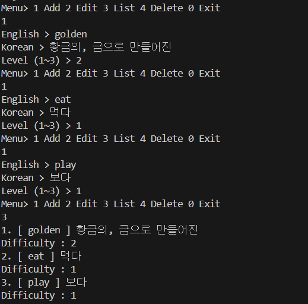
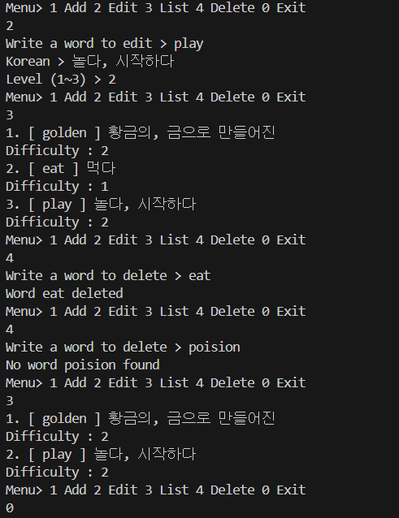
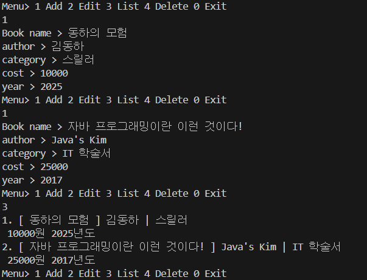
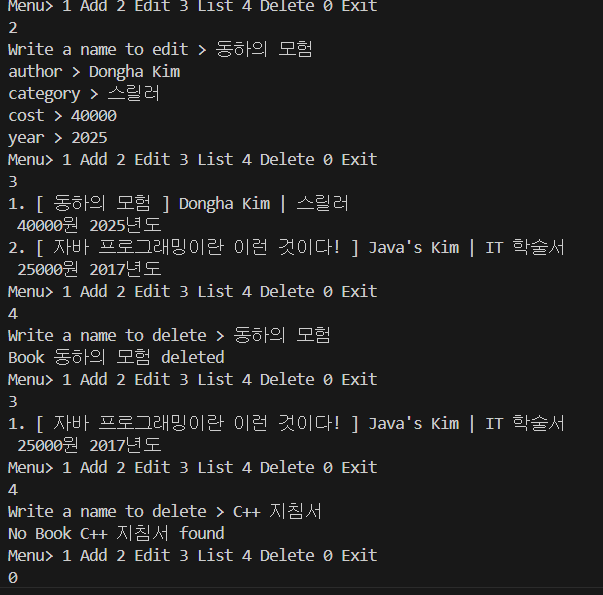
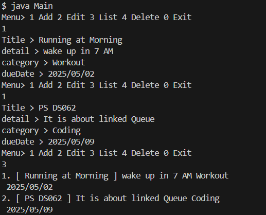
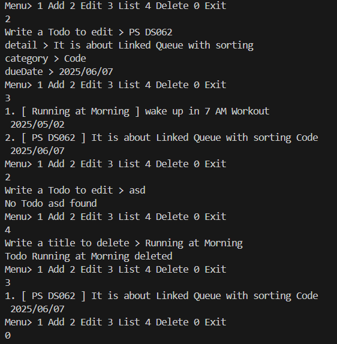

### 22200066 김동하 05분반

##### 프로그래밍 스튜디오 Java Lab 006

### 소감

## 사진

---
+ ___J061 단어장 프로그램 Ver1___

+ ___J062 도서관리 프로그램___

+ ___J065 일정관리 프로그램___

---

+ **61번문제** 단어장 프로그램
> 단어를 입력받고, 출력하는 간단한 프로그램. 관건은 list 사용인데, 이런게 있었으면 미리 써볼걸 그랬다. 나머지는 다 쉬웠는데, 문제는 Incoding 관련이였다. VScode에서 스캐너를 사용할 때, 한글이 깨진다는 문제가 있었는데, Scanner에 인코딩 세팅을 넣어주니, 깔끔하게 작동했다. 

+ **62번문제**  도서관리 프로그램
> 책을 관리하는 프로그램인데, 어려운건 없었다.

+ **63번문제** 일정관리 프로그램
> 61번문제와 거의 비슷하다.

---

CRUD가 만들었을때, 가장 만족감이 높은 것 같다. 일단 결과물이 이쁘기 때문이다. 코딩에서 시간을 얼마 안쓰면, 자연스럽게 꾸미는 쪽에 눈이 가는데, 그런 방면에서 CRUD가 제일 이쁜 것 같다.  

