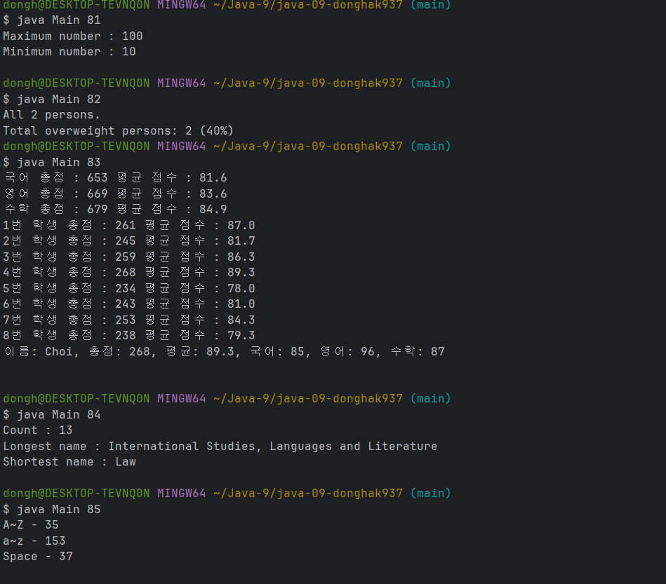

### 22200066 김동하 05분반

##### 프로그래밍 스튜디오 Java Lab 009

### 소감

## 사진

---
+ ___J081-085 Java File IO___

---

+ **81번문제** 최대값 최소값
> 파일에서 입력 받아서 최대 최소를 구하는 프로그램. 메인 하나에 통합하는게 조금 어려웠지만, 해보니까 오히려 간단하고 쉽다.

+ **82번문제** Bmi 구하기 프로그램
> 가장 기본적이고 여러번 해본 프로그램인데, 입출력만 하는거다.

+ **83번문제** 점수 관리 프로그램
> 점수매니저를 만들어서 해결하는 방식을 얼마 써보지는 않았는데, 해보니까 정말 편하다.

+ **84번문제** 가장 긴, 짧은 거 찾기
> foreach로 풀고 싶어서 foreach를 사용했다. 입출력만 다르고 나머지는 다 쉬운 문제다.

+ **85번문제** 대소문자 공백 수
> 이것도 어렵지 않은 문제다. 그냥 풀었다.

---

사실 C배울 때는 입출력이 너무 싫었다. 어렵고 짜증났는데, 실제로 입출력으로 해보니까, 자바는 훨씬 직관적이라는 생각이 들었다.

